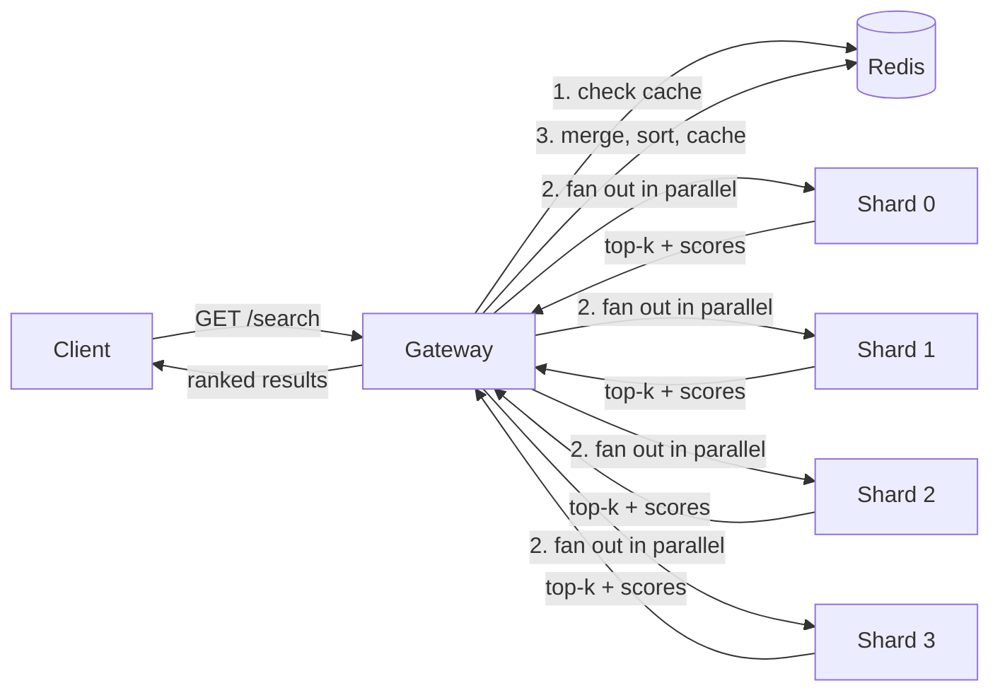

# Distributed Search & Information Retrieval Engine

A sharded document search engine built from scratch: inverted indexing, BM25/TF-IDF ranking, parallel shard fan-out with result aggregation, and Redis-backed caching, exposed over REST and containerized with Docker Compose.

Every core piece — the inverted index, BM25 scoring, query parsing, shard aggregation — is implemented from first principles rather than wrapping a library like Elasticsearch, so the ranking math and the distributed-query logic are fully owned and explainable end to end.

## Architecture



**Flow:** a client hits the gateway → cache check on the normalized query → on a miss, the gateway fans the query out to every shard service concurrently (`asyncio.gather` over async HTTP calls) → each shard independently scores its own partition of the corpus with BM25 → the gateway merges every shard's top-k into one global top-k by score, caches it, and returns it. If a shard is down or times out, the gateway logs it and returns results from whatever shards responded instead of failing the whole request.

## Features

- **Inverted indexing** over a sharded corpus (partitioned by `doc_id % num_shards`)
- **BM25 ranking** (hand-implemented, standard k1/b hyperparameters) with **TF-IDF** as a selectable alternative
- **Query parsing**: tokenization, stopword filtering, and quoted-phrase detection with a title-match relevance boost
- **Parallel shard-level search** with async fan-out and result aggregation at the gateway
- **Redis caching** of aggregated results, keyed on the normalized query (best-effort — a Redis outage degrades to "always miss," never a failure)
- **Fault-tolerant aggregation** — a failed/slow shard doesn't take down the whole query
- **REST API** (FastAPI) for both the gateway and each shard, with structured JSON logging (query, latency, cache hit/miss, shards queried)
- **29 unit + integration tests** (pytest) covering ranking math, index build/serialize, query parsing, and both services' HTTP contracts, including simulated shard failure
- **Containerized deployment** via Docker Compose: Redis + a one-shot indexer job + 4 shard containers + 1 gateway container
- **Benchmark suite** measuring latency percentiles, throughput, cache hit rate, and ranking quality (Precision@k, NDCG@k) against a synthetic ground-truth corpus

## Tech stack

Python · FastAPI · Redis · Docker / Docker Compose · asyncio/httpx · pytest · GitHub Actions

## Project structure

```
distributed-search-engine/
├── common/                # shared library, imported by both services
│   ├── tokenizer.py        # tokenize + stopword filter
│   ├── ranking.py          # BM25 / TF-IDF scoring
│   ├── inverted_index.py   # ShardIndex: build, save, load
│   ├── query_parser.py     # terms + quoted-phrase extraction
│   ├── cache.py             # Redis wrapper
│   └── logging_config.py    # structured JSON logging
├── shard_service/main.py   # FastAPI app: search over ONE shard
├── gateway_service/main.py # FastAPI app: fan-out, aggregate, cache
├── scripts/
│   ├── generate_corpus.py  # synthetic topic-labeled corpus generator
│   ├── build_shards.py     # partitions corpus, builds inverted indexes
│   └── benchmark.py        # latency/throughput/ranking-quality suite
├── tests/{unit,integration}/
├── Dockerfile
├── docker-compose.yml
└── .github/workflows/ci.yml
```

## Live demo

A hosted version runs at **`<add your Render URL here after deploying>`** — try `GET /search?q=neural+network+training&top_k=5`.

The full distributed architecture above (4 shard containers + gateway + Redis, talking over HTTP) is what's built and tested in this repo, and is exactly what `docker compose up` runs. The live demo linked above runs the *same* ranking/indexing/aggregation code (`common/ranking.py`, `common/inverted_index.py`, `common/query_parser.py`) from `demo_service/main.py`, which does the shard fan-out and merge in-process instead of over the network — a deliberate simplification for free hosting, since running 5 always-on containers isn't free. See `demo_service/main.py`'s module docstring for details.

## Quick start

### Option A — Docker Compose (recommended)

```bash
docker compose up --build
```

This starts Redis, generates a 50,000-document synthetic corpus, builds 4 shard indexes, then brings up all 4 shard services and the gateway. Once it's up:

```bash
curl "http://localhost:8000/search?q=gradient+descent+training&top_k=5"
```

### Option B — Local, no Docker

```bash
pip install -r requirements.txt
python scripts/generate_corpus.py --num-docs 50000 --out data/corpus/corpus.jsonl
python scripts/build_shards.py --corpus data/corpus/corpus.jsonl --num-shards 4 --out-dir data/shards

# in separate terminals:
SHARD_ID=0 SHARD_DATA_DIR=data/shards uvicorn shard_service.main:app --port 8001
SHARD_ID=1 SHARD_DATA_DIR=data/shards uvicorn shard_service.main:app --port 8002
SHARD_ID=2 SHARD_DATA_DIR=data/shards uvicorn shard_service.main:app --port 8003
SHARD_ID=3 SHARD_DATA_DIR=data/shards uvicorn shard_service.main:app --port 8004
SHARD_URLS="http://localhost:8001,http://localhost:8002,http://localhost:8003,http://localhost:8004" \
  uvicorn gateway_service.main:app --port 8000
```

### Run the tests

```bash
pytest tests/ -v
```

### Run the benchmark

```bash
python scripts/benchmark.py --gateway http://localhost:8000 --corpus data/corpus/corpus.jsonl \
  --requests 300 --concurrency 10
```

## API

**`GET /search?q=<query>&top_k=<n>&method=bm25|tfidf`** (gateway, port 8000)

```json
{
  "query": "gradient descent training",
  "method": "bm25",
  "top_k": 5,
  "total_candidates": 20,
  "took_ms": 39.2,
  "cache_hit": false,
  "shards_queried": 4,
  "results": [
    {"doc_id": 28575, "score": 11.68, "title": "...", "snippet": "...", "shard_id": 3}
  ]
}
```

**`GET /health`** — every service exposes this for container health checks.

## Benchmark results

Measured against the 50,000-document synthetic corpus (4 shards, 300 requests, concurrency 10, 80/20 head/long-tail query mix), on a **1-vCPU development machine** — throughput and tail latency scale up substantially on multi-core / production hardware, since both the shard scoring and the gateway fan-out parallelize across cores.

| Metric | Value |
|---|---|
| Throughput | ~111 requests/sec |
| Latency p50 | ~39 ms |
| Latency p95 | ~431 ms |
| Latency p99 | ~567 ms |
| Cache hit rate | 84% (80/20 head/long-tail traffic mix) |
| Precision@10 | 1.00 (synthetic ground truth) |
| NDCG@10 | 1.00 (synthetic ground truth) |

Ranking quality is measured against a synthetic ground truth: the corpus generator labels every document with a source topic, and a query built from that topic's vocabulary is checked against how many of the top-k results share the topic. A perfect score here validates that the retrieval and ranking logic work correctly — it's a sanity check on the algorithm, not a claim about real-world search relevance, which would need human relevance judgments.

## Design decisions & tradeoffs

- **Sharding via `doc_id % num_shards`** is simple and demonstrates the pattern, but reshards the entire corpus if `num_shards` changes. A production system would use consistent hashing to avoid a full rebuild.
- **Shards are independent FastAPI services**, not just in-process partitions — this makes the "distributed" claim real: the gateway talks to them over HTTP, exactly as it would if they lived on different machines.
- **Caching is best-effort**: `common/cache.py` catches Redis errors and no-ops rather than raising, so a cache outage degrades latency, not availability.
- **A failed shard doesn't fail the query** — `gateway_service/main.py`'s `_query_shard` catches timeouts/HTTP errors per-shard and the gateway aggregates whatever came back, which is the standard tradeoff distributed search systems make (partial results over total failure).
- **BM25 is implemented from the published formula** (not a library) so the scoring logic is fully inspectable and testable in isolation (see `tests/unit/test_ranking.py`, including a hand-computed value check).

## Possible extensions

- Add a proper document store (Postgres/SQLite) instead of keeping documents in the pickled shard index
- Consistent hashing for shard assignment
- A `/search` streaming variant that returns shard results as they arrive instead of waiting for all of them
- Query-side spelling correction / synonym expansion
- Swap the synthetic corpus for a real one (e.g. Wikipedia abstracts or MS MARCO) for a genuine ranking-quality evaluation

## License

MIT
